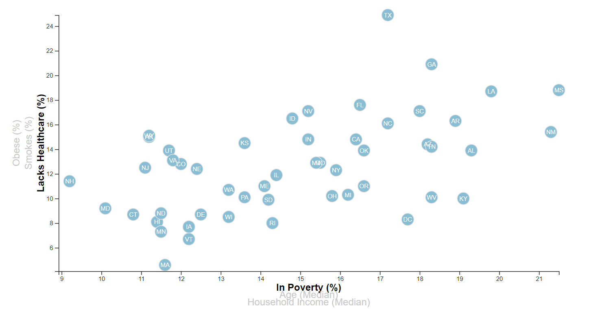

# U.S. Census Bureau

### Background
Built an interactive Scatter Plot to show the relationship between multiple categories extracted from the [US Census Bureau](https://data.census.gov/cedsci/) that includes data on rate of income, obesity, poverty, etc. by state.

###  Design

Using `HTML`, `Javascript`, `CSS` and `D3js` library to read a `.csv` file to generate a scatter plot based on axes selections from the user. The following categories are available on their respectives axis:

X Axis:
* Poverty
* Age
* Income

Y Axis:
* Healthcare
* Smokes
* Obesity

To access this interactive scatter plot [click here](https://gucaselo.github.io/D3/).

### Reference
* Refer to the [Data](assets/data/data.csv) to learn more about this dataset.
